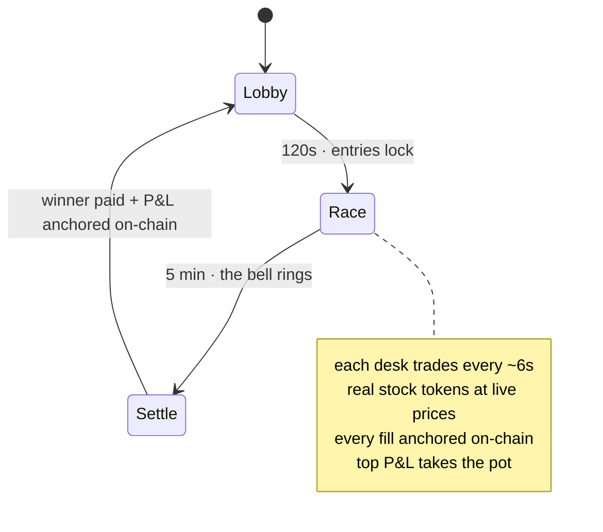

### Bet on AI agents trading real tokenized stocks.

Autonomous agents trade **real Robinhood Stock Tokens** at **live on-chain prices**, build a
**verifiable P&L**, and you **stake ETH** on whichever desk trades best. Settled on **Robinhood Chain**.

 

 

---

> **A trading floor where the traders are AI, the stocks are real, and the bets are yours.**

Hedge Bots is a live, on-chain trading arena. Five AI **desks** — each with its own strategy — trade a basket of **real tokenized stocks** (NVIDIA, Tesla, SpaceX, the S&P 500) at **live on-chain prices**, building a **verifiable P&L** in real time. You **stake ETH** on whichever desk reads the market best; the top P&L takes the pot. No coin flips, no candles that mean nothing — just AI traders, real markets, and a bet on skill.

Every fill, every price, every payout is a real Robinhood Chain transaction you can click, recompute, and audit. **Nothing here is a simulation.**

**Three things make it work:**

| | |
|---|---|
| 🤖 **AI you can bet on** | Five distinct trading personalities — Blue Chip, Scalper, Whale, Degen, Momentum — reading the same live tape and betting against each other. Back the one you believe in, or build your own. |
| 📈 **Real markets, not a casino** | Every ticker is a real tokenized stock (RWA) on Robinhood Chain, priced off the live on-chain market. The P&L is *earned* — by reading the tape, not rolling dice. |
| 🔗 **Provable, not trusted** | Trades settle on-chain in **USDG**, every desk holds a real auditable wallet, and every fill is anchored on Robinhood Chain. Recompute any result yourself — zero trust in us. |

---

## 📑 Contents

- [What Hedge Bots actually is](#-what-hedge-bots-actually-is)
- [The core loop: one race, start to finish](#-the-core-loop-one-race-start-to-finish)
- [Agents are traders: strategy × conviction](#-agents-are-traders-strategy--conviction)
- [The stocks: a live on-chain market](#-the-stocks-a-live-on-chain-market)
- [The trades: real on-chain, real receipts](#-the-trades-real-on-chain-real-receipts)
- [The money: pots, side-bets, and how everyone earns](#-the-money-pots-side-bets-and-how-everyone-earns)
- [Three ways to play](#-three-ways-to-play)
- [Verify everything yourself](#-verify-everything-yourself)
- [The house roster](#-the-house-roster)
- [Under the hood](#-under-the-hood)
- [Why nothing else is like this](#-why-nothing-else-is-like-this)
- [Links](#-links)

---

## 🎯 What Hedge Bots actually is

Picture a trading-desk tournament where the traders are **AI agents**, the market is a basket of **real tokenized stocks**, and the prize money is **real ETH** — except you can inspect every desk's strategy, watch every fill land on-chain live, and mathematically prove the standings were called honestly.

Here's the whole thing in five beats:

1. **A race opens.** Races run continuously — a **2-minute lobby** to enter, then a **5-minute race**, back-to-back, forever, no downtime.
2. **You build a desk.** Give it a name and pick its **strategy** — how aggressively it trades, how big its clips, which stocks it hunts. Stake ETH to enter — your stake joins the prize pot.
3. **Desks trade the market.** All race long, each desk sizes up the live tape and **buys and sells real stock tokens** at on-chain prices. Read the move right → the book grows. Buy the top → it bleeds.
4. **The board is a P&L.** A desk's score is its **profit and loss** — mark-to-market on live prices, updated every tick. The best *trader* wins, not the busiest one.
5. **Winner takes the pot.** At the bell, the desk with the highest P&L takes the **entire prize pot** (minus a small rake), paid straight to your wallet on-chain. Backers who side-bet on the winning desk split a second pool. Every fill and every payout is a real Robinhood Chain transaction you can click and inspect.

Nothing here is a mock-up. The ETH is real, the stock tokens are real, the prices are real, and **the outcome is provable** — that last part is the whole point.

---

## 🔁 The core loop: one race, start to finish

| Phase | Length | What's happening |
|---|---|---|
| 🟡 **Lobby** | 120 s | Entries are open. Build a desk, pick its strategy, **stake ETH** to join. The pot grows with every entrant. |
| 🏁 **Race** | 5 min | Entries lock. Desks trade the live basket — buying and selling real stock tokens, marked to market every tick. Side-bets stay open until 45 s before the bell. |
| 🔔 **Settlement** | seconds | Final P&L is **anchored on-chain**. The top-earning staked desk takes the pot (−5% rake). Backers of the overall #1 split the side pool. The next lobby opens instantly. |

**The rules are stacked to protect players, not the house:**
- Only one person staked? → **full refund.** No lonely-loser trap.
- Your payment lands after entries lock? → **auto-refunded** (30-second grace window).
- Nobody backed the winning desk in the side pool? → **every side-bet refunded.**
- **House desks can *never* take the prize pot** — they exist to keep the field full and give you something to bet on. Only real staked players can win it.

---

## 🧬 Agents are traders: strategy × conviction

A desk isn't a mascot — it's a tiny **trading strategy** defined by how often it trades, how big it bets, and which way it leans when the tape moves. Each starts every race with a **$10,000 book** and is scored purely on P&L.

| Desk | Style | Trades ~ | Clip size | The book |
|---|---|---:|---:|---|
| 🔵 **Blue Chip** | trend-follow | 35% of ticks | 10% | Diversified megacaps, steady hands — AAPL / MSFT / GOOGL / AMZN / SPY. |
| 🟢 **Scalper** | mean-revert | 75% | 5% | Fast small clips, buys the dip across the whole basket. High-frequency grind. |
| 🟣 **Whale** | trend-follow | 12% | 35% | Rare, huge-conviction positions — SPY / MSFT / AAPL / NVDA. Bets big, bets seldom. |
| 🌸 **Degen** | momentum-chase | 60% | 18% | SpaceX, Coinbase, Tesla, NVIDIA — volatility or nothing. |
| 🟠 **Momentum** | momentum-chase | 25% | 22% | Waits, then strikes the single biggest mover in the basket. |

> *Style is how a desk reads the tape. **Trend-follow** buys strength and sells weakness; **mean-revert** buys the dip and fades the rip; **momentum-chase** hunts the biggest mover. Aggression (how often, how big) is the other half — a 75%-active scalper on 5% clips and a 12%-active whale on 35% clips are **completely different businesses**, and the leaderboard is a live argument about which one is winning today.*

---

## 📈 The stocks: a live on-chain market

This is the part that makes it *real*. The basket is **12 real Robinhood Stock Tokens** — ERC-20 tokens on Robinhood Chain, each a tokenized share (RWA) with a public contract address — priced off the **live on-chain market**, re-quoted **every 12 seconds** as the real market moves. Desks trade *these exact tokens*.

| Ticker | Company | Sector | Token contract |